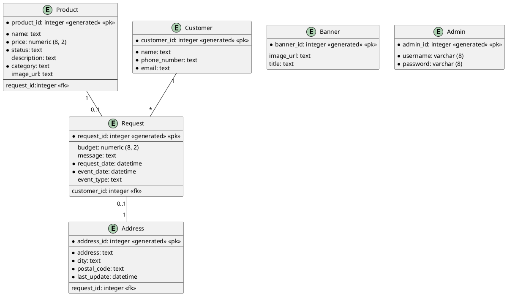

## Physical Diagram

```plantuml
@startuml

entity Product
{
    * product_id: integer <<generated>> <<pk>>
    --
    * name: text
    * price: numeric (8, 2)
    * status: text
    description: text
    * category: text
    image_url: text
    --
    request_id:integer <<fk>>
}

entity Request
{
    * request_id: integer <<generated>> <<pk>>
    --
    budget: numeric (8, 2)
    message: text
    * request_date: datetime
    * event_date: datetime
    event_type: text
    --
    customer_id: integer <<fk>>
}

entity Customer
{
    * customer_id: integer <<generated>> <<pk>>
    --
    * name: text
    * phone_number: text
    * email: text
}

entity Address
{
    * address_id: integer <<generated>> <<pk>>
    --
    * address: text
    * city: text
    * postal_code: text
    * last_update: datetime
    --
    request_id: integer <<fk>>
}

entity Banner
{
    * banner_id: integer <<generated>> <<pk>>
    --
    image_url: text
    title: text
}

entity Admin
{
    * admin_id: integer <<generated>> <<pk>>
    --
    * username: varchar (8)
    * password: varchar (8)
}

Product "1" -- "0..1" Request
Customer "1" -- "*" Request
Request "0..1" -- "1" Address


@enduml
```